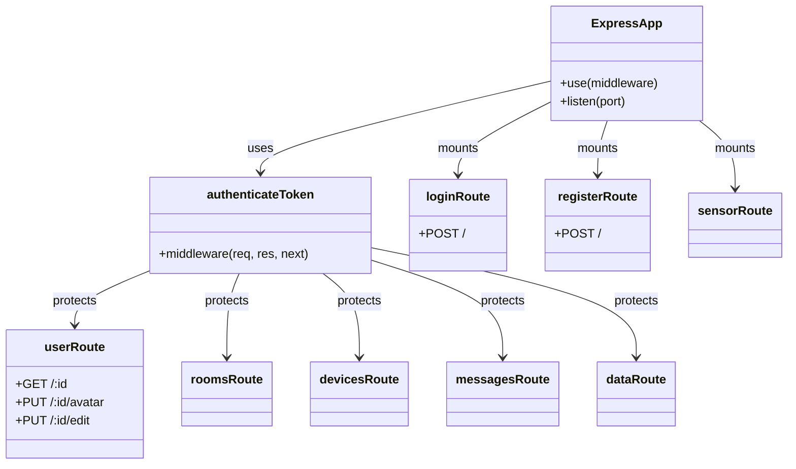

## API Routes and middleware

```mermaid
classDiagram
    class ExpressApp {
        +use(middleware)
        +listen(port)
    }
    class authenticateToken {
        +middleware(req, res, next)
    }
    class loginRoute {
        +POST /
    }
    class registerRoute {
        +POST /
    }
    class userRoute {
        +GET /:id
        +PUT /:id/avatar
        +PUT /:id/edit
    }
    class roomsRoute
    class devicesRoute
    class messagesRoute
    class dataRoute
    class sensorRoute
    
    ExpressApp --> loginRoute: mounts
    ExpressApp --> registerRoute: mounts
    ExpressApp --> authenticateToken: uses
    authenticateToken --> userRoute: protects
    authenticateToken --> roomsRoute: protects
    authenticateToken --> devicesRoute: protects
    authenticateToken --> messagesRoute: protects
    authenticateToken --> dataRoute: protects
    ExpressApp --> sensorRoute: mounts
```
