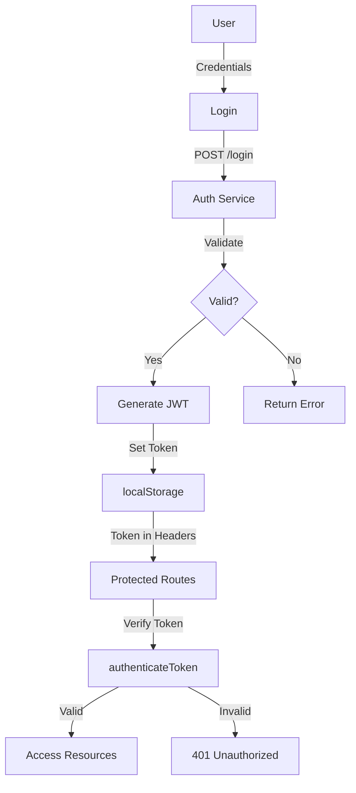

## Authentication Flow

```mermaid
flowchart TD
    A[User] -->|Credentials| B[Login]
    B -->|POST /login| C[Auth Service]
    C -->|Validate| D{Valid?}
    D -->|Yes| E[Generate JWT]
    D -->|No| F[Return Error]
    E -->|Set Token| G[localStorage]
    G -->|Token in Headers| H[Protected Routes]
    H -->|Verify Token| I[authenticateToken]
    I -->|Valid| J[Access Resources]
    I -->|Invalid| K[401 Unauthorized]
```

