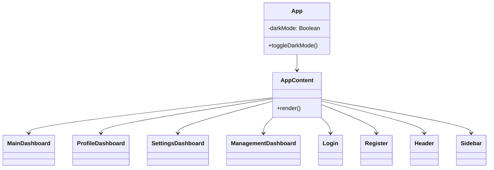

## Component Hierarchy

```mermaid
classDiagram
    class App {
        -darkMode: Boolean
        +toggleDarkMode()
    }
    class AppContent {
        +render()
    }
    class MainDashboard
    class ProfileDashboard
    class SettingsDashboard
    class ManagementDashboard
    class Login
    class Register
    class Header
    class Sidebar
    
    App --> AppContent
    AppContent --> MainDashboard
    AppContent --> ProfileDashboard
    AppContent --> SettingsDashboard
    AppContent --> ManagementDashboard
    AppContent --> Login
    AppContent --> Register
    AppContent --> Header
    AppContent --> Sidebar
```
