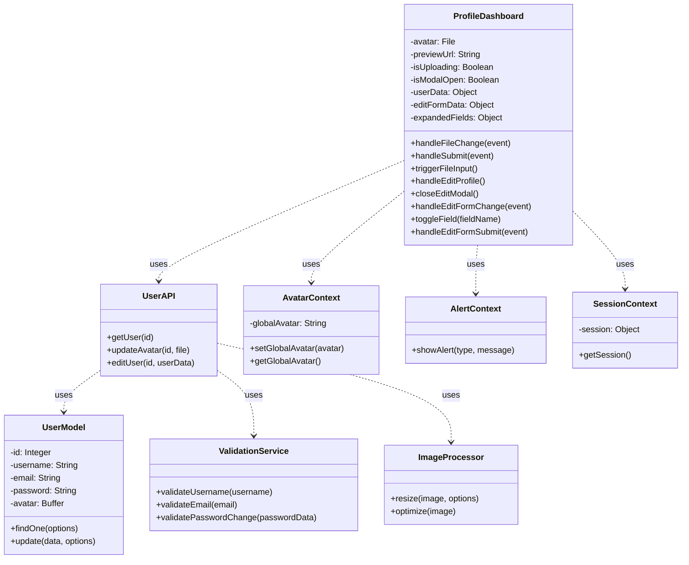

## Profile Dashboard Component

```mermaid
classDiagram
    class ProfileDashboard {
        -avatar: File
        -previewUrl: String
        -isUploading: Boolean
        -isModalOpen: Boolean
        -userData: Object
        -editFormData: Object
        -expandedFields: Object
        +handleFileChange(event)
        +handleSubmit(event)
        +triggerFileInput()
        +handleEditProfile()
        +closeEditModal()
        +handleEditFormChange(event)
        +toggleField(fieldName)
        +handleEditFormSubmit(event)
    }

    class UserAPI {
        +getUser(id)
        +updateAvatar(id, file)
        +editUser(id, userData)
    }

    class UserModel {
        -id: Integer
        -username: String
        -email: String
        -password: String
        -avatar: Buffer
        +findOne(options)
        +update(data, options)
    }

    class ValidationService {
        +validateUsername(username)
        +validateEmail(email)
        +validatePasswordChange(passwordData)
    }

    class AvatarContext {
        -globalAvatar: String
        +setGlobalAvatar(avatar)
        +getGlobalAvatar()
    }

    class AlertContext {
        +showAlert(type, message)
    }

    class SessionContext {
        -session: Object
        +getSession()
    }

    class ImageProcessor {
        +resize(image, options)
        +optimize(image)
    }

    ProfileDashboard ..> UserAPI: uses
    ProfileDashboard ..> AvatarContext: uses
    ProfileDashboard ..> AlertContext: uses
    ProfileDashboard ..> SessionContext: uses
    UserAPI ..> UserModel: uses
    UserAPI ..> ValidationService: uses
    UserAPI ..> ImageProcessor: uses
```

