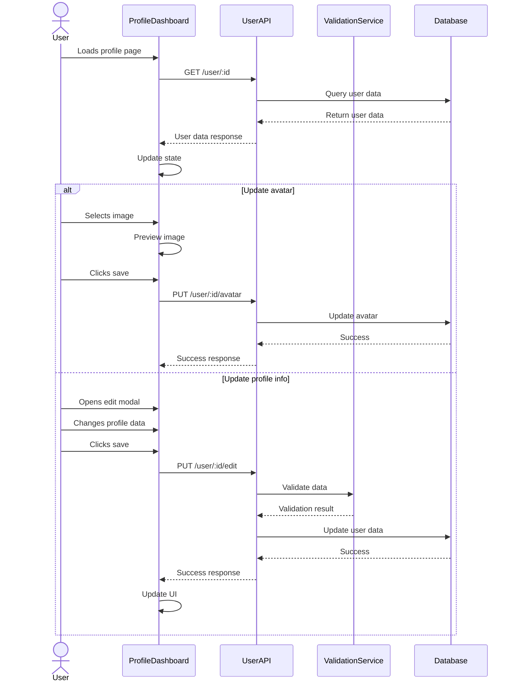

## Sequence Diagram for Profile Management

```mermaid
sequenceDiagram
    actor User
    participant ProfileDashboard
    participant UserAPI
    participant ValidationService
    participant Database
    
    User->>ProfileDashboard: Loads profile page
    ProfileDashboard->>UserAPI: GET /user/:id
    UserAPI->>Database: Query user data
    Database-->>UserAPI: Return user data
    UserAPI-->>ProfileDashboard: User data response
    ProfileDashboard->>ProfileDashboard: Update state
    
    alt Update avatar
        User->>ProfileDashboard: Selects image
        ProfileDashboard->>ProfileDashboard: Preview image
        User->>ProfileDashboard: Clicks save
        ProfileDashboard->>UserAPI: PUT /user/:id/avatar
        UserAPI->>Database: Update avatar
        Database-->>UserAPI: Success
        UserAPI-->>ProfileDashboard: Success response
    else Update profile info
        User->>ProfileDashboard: Opens edit modal
        User->>ProfileDashboard: Changes profile data
        User->>ProfileDashboard: Clicks save
        ProfileDashboard->>UserAPI: PUT /user/:id/edit
        UserAPI->>ValidationService: Validate data
        ValidationService-->>UserAPI: Validation result
        UserAPI->>Database: Update user data
        Database-->>UserAPI: Success
        UserAPI-->>ProfileDashboard: Success response
        ProfileDashboard->>ProfileDashboard: Update UI
    end
```

