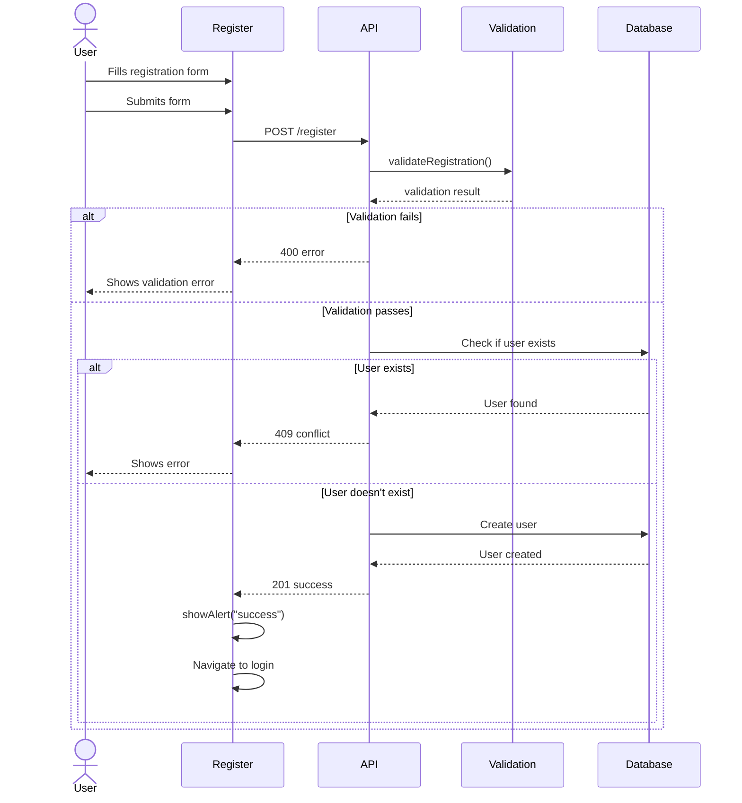

## Sequence Diagram for User Registration Flow

```mermaid
sequenceDiagram
    actor User
    participant Register
    participant API
    participant Validation
    participant Database
    
    User->>Register: Fills registration form
    User->>Register: Submits form
    Register->>API: POST /register
    API->>Validation: validateRegistration()
    Validation-->>API: validation result
    
    alt Validation fails
        API-->>Register: 400 error
        Register-->>User: Shows validation error
    else Validation passes
        API->>Database: Check if user exists
        
        alt User exists
            Database-->>API: User found
            API-->>Register: 409 conflict
            Register-->>User: Shows error
        else User doesn't exist
            API->>Database: Create user
            Database-->>API: User created
            API-->>Register: 201 success
            Register->>Register: showAlert("success")
            Register->>Register: Navigate to login
        end
    end
```
