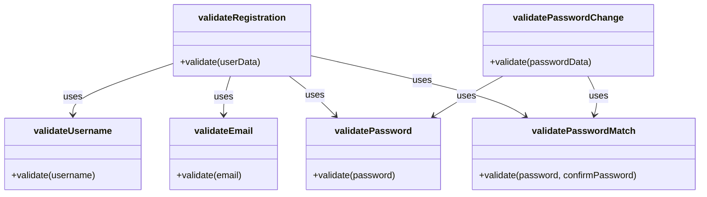

## Validation Logic

```mermaid
classDiagram
    class validateRegistration {
        +validate(userData)
    }
    class validatePasswordChange {
        +validate(passwordData)
    }
    class validateUsername {
        +validate(username)
    }
    class validateEmail {
        +validate(email)
    }
    class validatePassword {
        +validate(password)
    }
    class validatePasswordMatch {
        +validate(password, confirmPassword)
    }
    
    validateRegistration --> validateUsername: uses
    validateRegistration --> validateEmail: uses
    validateRegistration --> validatePassword: uses
    validateRegistration --> validatePasswordMatch: uses
    validatePasswordChange --> validatePassword: uses
    validatePasswordChange --> validatePasswordMatch: uses
```